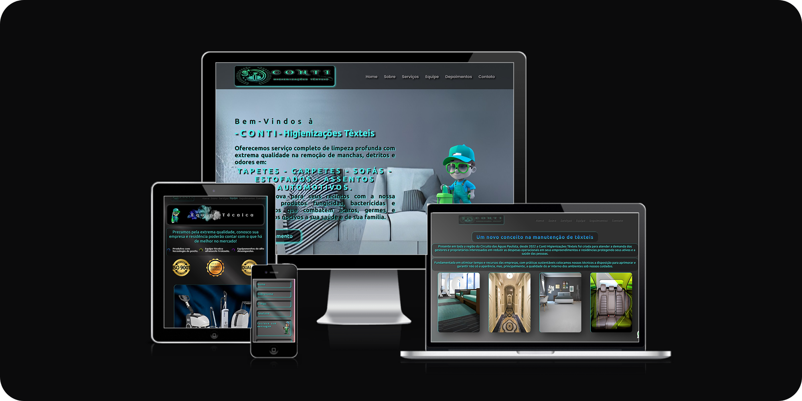

# Project of a Institutional Website - Conti Higienizações Têxteis

## Professional Project - Front-End Development

### Based on modern web development concepts.

Preview of the completed project :
<br>

### 🎯 Objective :

> - Develop a static institutional website for **_`Conti Higienizações Têxteis`_**, a professional cleaning company in the _Circuito das Águas Paulista_, headquartered in _Águas de Lindóia, São Paulo, Brazil_. The website promotes textile cleaning services for businesses, hotels, homes, and automobiles, with a responsive, interactive, and accessible layout, built with a focus on the most fundamental levels of programming to consolidate essential concepts, using **_[HTML](https://developer.mozilla.org/en-US/docs/Web/HTML)_** , **_[CSS](https://developer.mozilla.org/en-US/docs/Web/CSS)_** , and **_[JavaScript](https://developer.mozilla.org/en-US/docs/Web/JavaScript)_** ( **_[jQuery](https://jquery.com/)_** ). ✅.

> - The project consolidates front-end development skills, including responsive design, animations ([AOS](https://michalsnik.github.io/aos/), [Typed.js](https://github.com/mattboldt/typed.js/), [VanillaTilt.js](https://micku7zu.github.io/vanilla-tilt.js/)), form integration ([FormSubmit](https://formsubmit.co/)), and interactive maps ([Google Maps](https://www.google.com/maps)). The site is optimized for mobile devices, tablets, and desktops (Full HD and 4K). 🔗

> - The modular structure and visual design (gradients, shadows, colors) ensure a fluid and professional user experience, with a focus on simplicity and maintainability. ✅.
>   > - 🎨 The entire visual identity, including design, UI/UX, images, mascots, and the company logotype, as well as social media and email assets, was conceived and created from scratch by me, with the approval of the brand owner. This process represented a significant challenge, as it involved using graphic design and image editing tools with which I was unfamiliar, requiring learning and adaptation to deliver a professional result aligned with the company's vision.

> - Includes _10+ sections_ (Home, About, Services, Team, Testimonial, Contact, Footer) with subtle animations, carousels ([Swiper.js](https://swiperjs.com/)), and form validation, meeting your business's visibility needs.
>   <br>

### 📌 Motivation

Conti Higienizações Têxteis' website was created to offer a professional online presence, highlighting its cleaning services with a modern, accessible interface. Unlike other institutional websites, it prioritizes simplicity, performance on low-end devices, and ease of contact, with direct integration with WhatsApp and email.

### 🧩 Features

- Responsive navigation with a fixed, mobile-friendly menu.
- Home section with animated text (Typed.js) and call-to-action button.
- About section with interactive cards (VanillaTilt.js) for different segments.
- Service carousels (Swiper.js) with images and detailed descriptions.
- Team section with background video and certification seals.
- Customer testimonials in a dynamic carousel.
- Contact form integrated with FormSubmit, with validation and visual feedback.
- Interactive Google Maps in the Contact section.
- Simple footer with clickable logo (opens image in a new tab), copyright, and links to WhatsApp and email.
- Responsive design for smartphones, tablets, and desktops in Full HD and 4K.
- Subtle animations with AOS and hover effects on buttons and images.
- Fixed WhatsApp button for quick contact.
- Basic SEO with meta tags and descriptive alt attributes.
<br>
<p align="center">

</p>
<table align="center">
  <tr>
    <td>
      
    </td>
    <td>
      
    </td>
  </tr>
</table>
<br>
<br>
<div align="center">

Click here to try it out .. thanks for your interest!  
( 🖱️ Ctrl + click to open in a new tab or visit [contihigeniezacoestexteis.onrender.com](https://contihigeniezacoestexteis.onrender.com)).

</div>
 <br>

#### Adjustments and improvements

The project is complete, but there is room for future improvements, which will be listed later.

---

### Resources used in the project

- [x] **Frontend**:&nbsp;&nbsp;&nbsp;&nbsp;&nbsp;&nbsp;[](https://developer.mozilla.org/en-US/docs/Web/HTML) &nbsp;[](https://developer.mozilla.org/en-US/docs/Web/CSS)&nbsp;[](https://developer.mozilla.org/en-US/docs/Web/JavaScript)&nbsp;[](https://jquery.com/)&nbsp;[](https://swiperjs.com/)&nbsp;[](https://michalsnik.github.io/aos/)&nbsp;[](https://mattboldt.com/typed-js/)&nbsp;[](https://micku7zu.github.io/vanilla-tilt.js/)&nbsp;[](https://boxicons.com/)&nbsp;[](https://ionicons.com/)
      <br>

- [x] **Development Tools and Testing**:&nbsp;&nbsp;&nbsp;[](https://marketplace.visualstudio.com/items?itemName=ritwickdey.LiveServer)&nbsp;&nbsp;[](https://developer.chrome.com/docs/devtools/)
      <br>

- [x] **Hosting and Deployment**:&nbsp;&nbsp;&nbsp;&nbsp;&nbsp;&nbsp;[](https://render.com)&nbsp;&nbsp;or&nbsp;&nbsp; [](https://netlify.com)
      <br>

- [x] **Planning and Editor**:&nbsp;&nbsp;&nbsp;&nbsp;&nbsp;&nbsp;[](https://figma.com/)&nbsp;&nbsp;[](https://code.visualstudio.com/)
      <br>

---

#### ⚙️ Steps for the project

✔️ - Planning :

- [x] Structure the website based on the needs defined by the contracting company.
- [x] Create manual wireframes for the layout (Home, About, Services, Team, Contact, Footer).
- [x] Choose a color palette and fonts.

  <br>
✔️ - Configure the environment :

- [ ] If you choose, clone the repository :

```bash
git clone https://github.com/ed-radanovis/Institutional_Website_Conti_HT_01-2024.git
```

- [ ] Navigate to the project folder: `conti-higienizacoes-texteis` or the folder you created and named.

---

#### 🖥️ Frontend

✔️ - Initialize the Project :

- [x] &nbsp;&nbsp;&nbsp;Create a file structure with `src/css` , `src/js` , `src/images` and `src/videos` folders.
- [x] &nbsp;&nbsp;&nbsp;Configure semantic `HTML` with modular modules.
- [x] &nbsp;&nbsp;&nbsp;Structure `CSS` by section (e.g., styles_0_global.css, styles_8_footer.css).

✔️ - Install Dependencies :

- [x] &nbsp;&nbsp;&nbsp;Include libraries via **CDN** :
      <br>

- Swiper.js:&nbsp;&nbsp;&nbsp;&nbsp;&nbsp;&nbsp;`<script src="https://cdn.jsdelivr.net/npm/swiper@11/swiper-bundle.min.js"></script>`
- AOS:&nbsp;&nbsp;&nbsp;&nbsp;&nbsp;&nbsp;&nbsp;&nbsp;&nbsp;&nbsp;&nbsp;&nbsp;&nbsp;`<script src="https://unpkg.com/aos@2.3.1/dist/aos.js"></script>`
- Typed.js:&nbsp;&nbsp;&nbsp;&nbsp;&nbsp;&nbsp;&nbsp;`<script src="https://cdn.jsdelivr.net/npm/typed.js@2.0.12"></script>`
- VanillaTilt.js:&nbsp;&nbsp;`<script src="https://cdn.jsdelivr.net/npm/vanilla-tilt@1.7.0/dist/vanilla-tilt.min.js"></script>`
- jQuery:&nbsp;&nbsp;&nbsp;&nbsp;&nbsp;&nbsp;&nbsp;&nbsp;&nbsp;&nbsp;`<script src="https://code.jquery.com/jquery-3.6.0.min.js"></script>`
- Boxicons:&nbsp;&nbsp;&nbsp;&nbsp;&nbsp;&nbsp;`<link href="https://unpkg.com/boxicons@2.1.4/css/boxicons.min.css" rel="stylesheet">`
- Ionicons:&nbsp;&nbsp;&nbsp;&nbsp;&nbsp;&nbsp;&nbsp;`<script type="module" src="https://unpkg.com/ionicons@7.1.0/dist/ionicons/ionicons.esm.js"></script>`

✔️ - Add Responsiveness :

- [x] &nbsp;&nbsp;&nbsp;Implement media queries for smartphones, tablets, desktops, and large screens (4K).
- [x] &nbsp;&nbsp;&nbsp;Adjust mobile menu layout and font/image sizes.

---

#### 🔗 Integration

✔️ - Contact Form :

- [x] &nbsp;&nbsp;&nbsp;Configure **FormSubmit** in HTML:

```html
<form action="https://formsubmit.co/<company-email>.com" method="POST"></form>
```

- [x] &nbsp;&nbsp;&nbsp;Configure FormSubmit with client-side validation in JavaScript.
- [x] &nbsp;&nbsp;&nbsp;Add visual feedback (e.g., "shake" animation on errors).

✔️ - Google Maps:

- [x] Insert Google Maps in HTML:

```html
<iframe src="https://www.google.com/maps/embed?pb=..." allowfullscreen></iframe>
```

- [x] &nbsp;&nbsp;&nbsp;Embed an interactive map with the business's location.

✔️ - WhatsApp Button:

- [x] &nbsp;&nbsp;&nbsp;Add fixed link to WhatsApp with company number.

---

#### 🔬 Enhancements

✔️ - **Image Optimization :** Convert images to **WebP** format to reduce load time and improve site performance, especially on mobile devices and slow connections.<br>
✔️ - **Firebase Integration :** Implement a database, such as _Firebase_, to manage and dynamically load images (e.g., service carousels, testimonial galleries, Team section images), allowing content updates without code changes, using **Firebase Storage** for image hosting and **Firestore** for metadata.<br>
✔️ - **Accessibility Improvements :** Add full keyboard navigation support for menus, carousels, forms, and links, ensuring compatibility with screen readers and users without a mouse.<br>
✔️ - **SEO Optimization :** Include advanced meta tags (e.g., description, keywords, og:image) to improve search engine visibility and site indexing.<br>
✔️ - **CSS Consolidation :** Unify media queries into an optimized _CSS_ file to improve maintainability and reduce code redundancies.

---

#### 🚀🌐 Deploy:

✔️ - Deploy on Render (Default choice - free) :

- [x] &nbsp;&nbsp;&nbsp;Go to [Render](https://render.com)
- [x] &nbsp;&nbsp;&nbsp;Create a new **Static Site**, connect the Git repository the `https://github.com/repository-created-by-you`.
- [x] &nbsp;&nbsp;&nbsp;Set the root directory to / (project root).
- [x] &nbsp;&nbsp;&nbsp;Deploy and access the generated URL (e.g., `https://<your-domain>.onrender.com)` or your custom domain after configuration).

❓ - Optional Deploy on on Netlify (Optional - Free Tier) :

- [ ] &nbsp;&nbsp;&nbsp;Go to [Netlify](https://netlify.com).
- [ ] &nbsp;&nbsp;&nbsp;Import the repository `https://github.com/repository-created-by-you`.
- [ ] &nbsp;&nbsp;&nbsp;Set the root directory to / (project root).
- [ ] &nbsp;&nbsp;&nbsp;Deploy and access the generated URL (e.g., `https://<your-domain>.netlify.app`).

<br> > <br>

<h4 align="center">
  👤 Developed by 
<h4/>
<table align="center"
  <tr>
    <td align="center">
      <a href="https://www.linkedin.com/in/edmar-radanovis/">
        <br>
      <sub>
        <b>Edmar Radanovis</b>
      </sub>
      </a>
    </td>
  </tr>
</table>
<br>

[⬆ Back to top ](#project-of-a-institutional-website---conti-higienizações-têxteis)
